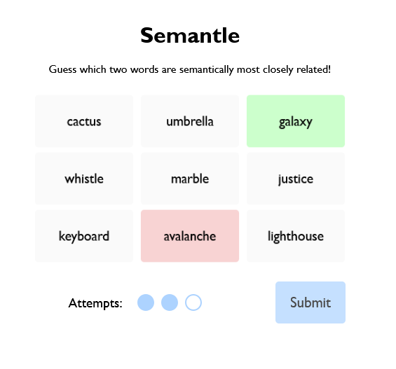
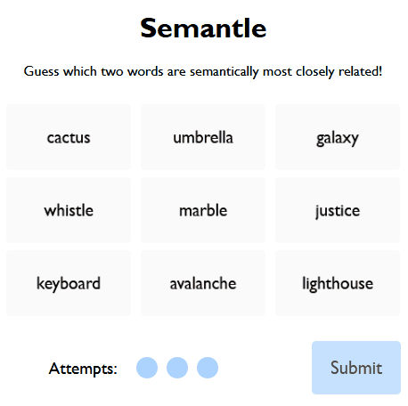

# Semantle README

## Overview

A small [NYT Connections](https://www.nytimes.com/games/connections)-inspired game prototype. Semantle was a working title - it would likely have to change due to the name already being used for another game.

This version of the game is only tested on desktop and missing many important features, such as responsiveness for smaller screens, nice touchscreen behaviour, and accessibility features for keyboard-only and screen-reader users. The game was largely an exercise in learning to use React and Typescript - there's plenty of tidying and commenting that ought to be done in the codebase if I choose to take the concept further in the future.

This game exists in a half-complete state because I decided to pursue a slightly different game concept that makes use of this prototype as a starting point.

## Gameplay

The game involves players correctly identifying the two words from a grid of nine that are most closely related semantically. This semantic relatedness score comes from the [ConceptNet Numberbatch](https://github.com/commonsense/conceptnet-numberbatch) word embeddings database, which is a wonderful free resource. An example of the game starting state can be seen below:

When the player correctly identifies the two words, they flip over and are no longer interactable - now the player must guess the *next two* most closely related words! This repeats until there is one word left, at which point, the player wins. 

If the player makes a mistake and guess incorrectly, they lose an attempt. Players get 3 attempts for the entirety of the game, and these attempts don't reset when they guess one pair correctly.

When the player guesses only one word that is part of the current correct pair, this word goes light green to indicate that it is a "correct" word. Any incorrect submitted words go light red to indicate they are not part of the current pair. An example of this can be seen below:

When the current pair is correctly identified, all word tiles reset to light grey.

One area that I spent a good bit of time on was using CSS and dynamic styling to give tiles a [Balatro](https://www.playbalatro.com/)-inspired effect. When the mouse hovers over a tile it raises off the page, and angles slightly towards the mouse. A linear-gradient enhances the 3D effect of the tile. When tiles flip, a CSS animation gives a pleasant flipping effect to cement this 3D behaviour. 

A full gameplay example can be found below:

